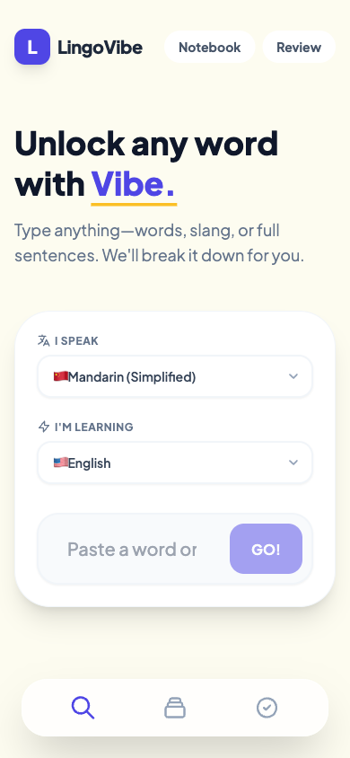
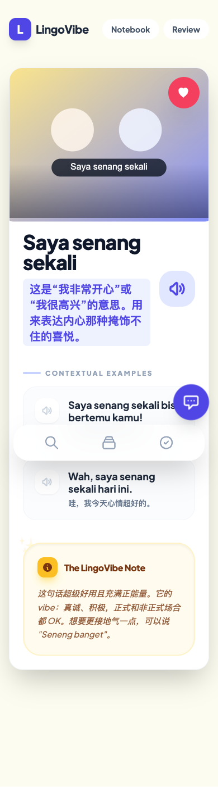
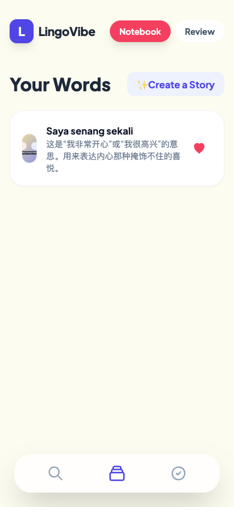
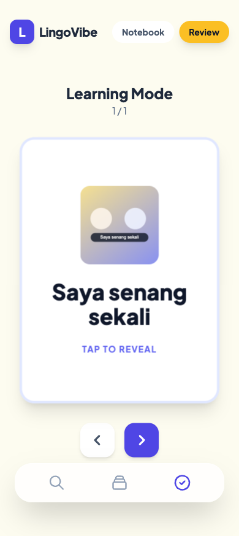

# LingoVibe｜AI 语境词典 Demo

> 一个面向多语言学习者的 AI 语言学习工具：不只翻译单词，而是把“含义、语气、例句、发音、记忆和复习”串成一条学习闭环。

[](#技术实现)
[](#技术实现)
[](#技术实现)
[](#技术实现)

## 30 秒看懂

LingoVibe 是我用 Google AI Studio + React / TypeScript 做出的可运行 AI 产品 Demo。它来自一个很具体的痛点：学习外语时，很多词不是“知道中文意思”就会用，尤其是口语、俚语、短句和带情绪的表达，更需要语境、语气、自然例句和反复复习。

这个项目想验证一件事：AI 词典可以从“查询工具”变成“轻量学习伙伴”。用户输入一个词或短句后，系统会输出自然解释、例句翻译、发音、语境提示、AI 图片，并支持收藏到 Notebook、生成故事和闪卡复习。

## Demo 界面

以下界面使用示例词条 `Saya senang sekali`，展示从查词到复习的完整链路。

| 首页输入 | 词条结果 |
| --- | --- |
|  |  |

| Notebook 收藏 | Review 闪卡复习 |
| --- | --- |
|  |  |

## 我负责什么

- **需求定义：** 从“外语学习者查到翻译但不会自然使用”的痛点出发，拆出查词、理解、追问、收藏、复习 5 个核心场景。
- **产品设计：** 设计首页输入、结构化结果页、Notebook 收藏、Review 闪卡复习等关键页面，让 Demo 呈现完整产品闭环，而不是单点 AI 聊天功能。
- **AI 工作流：** 用结构化提示词和 Schema 约束模型输出，降低大模型回答漂移、字段缺失和前端渲染不稳定的问题。
- **原型实现：** 基于 React / TypeScript / Vite 实现移动端优先的可运行 Demo，接入 Gemini 文本生成、图片生成与 TTS 发音能力。
- **用户反馈与迭代：** 邀请 1 位在印尼创业、具备真实印尼语使用场景的朋友试用；基于“发音自然度、朗读延迟、结果页加载等待感”等反馈完成 1 版体验迭代。

## 核心功能

- **多语言输入：** 支持 11 种常见语言，用户可选择自己的母语和正在学习的目标语言。
- **语境化解释：** 输入单词、短语、俚语或完整句子后，输出母语解释、例句、例句翻译、使用场景和易混表达提示。
- **发音辅助：** 为目标词和例句提供 TTS 发音，帮助用户判断表达是否自然。
- **AI 视觉记忆：** 为词条生成概念图，用图片帮助记忆抽象词义或情绪表达。
- **追问聊天：** 用户可以围绕当前词条继续追问语气、近义词、口语替代表达或使用场景。
- **Notebook 收藏：** 把查过的词条保存到本地 Notebook，方便之后复习。
- **故事生成与闪卡复习：** 将收藏词条串成短故事，并通过 Review 模式做轻量翻卡复习。

## 产品思考

传统词典很适合“查定义”，但对真实表达的帮助有限；通用 AI 聊天很灵活，但结果容易发散，也不利于沉淀复习。因此 LingoVibe 的设计重点不是做一个更复杂的聊天框，而是把 AI 输出收敛成可学习、可收藏、可复习的结构化内容。

我在这个 Demo 中重点练习了三个 AI 产品经理能力：

- **把模糊需求产品化：** 从“我想知道这个词怎么用”拆成可交互的信息架构和学习路径。
- **把模型能力流程化：** 让大模型承担解释、例句、语气判断、图片提示和复习内容生成，而不是只返回一段自由文本。
- **把 Demo 做成可展示作品：** 用真实场景用户反馈驱动迭代，让项目能在简历和面试中承接“AI 产品实践”的证明作用。

## 技术实现

- **前端：** React 19、TypeScript、Vite、Tailwind CSS
- **AI 能力：** `@google/genai`，覆盖文本生成、图片生成与 TTS 发音
- **内容渲染：** React Markdown，用于展示解释和追问内容
- **本地存储：** Browser localStorage，用于保存 Notebook 词条
- **稳定性设计：** 使用 JSON Schema 约束模型输出结构，减少字段漂移和 UI 渲染失败

## 如何运行

```bash
npm install
```

创建 `.env.local`，写入 Gemini API Key：

```bash
GEMINI_API_KEY=your_api_key_here
```

启动本地开发环境：

```bash
npm run dev
```

构建生产版本：

```bash
npm run build
```

## 隐私说明

这个仓库不展示 Google AI Studio 原始应用链接，避免暴露完整 prompt、实验过程和私人迭代记录。公开内容只用于展示项目代码、产品思路、关键界面和可复盘的迭代过程。
